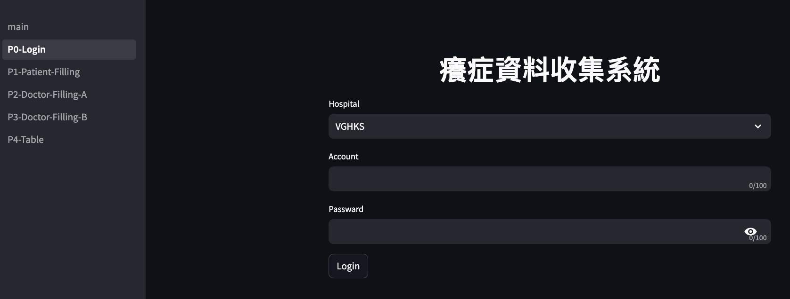
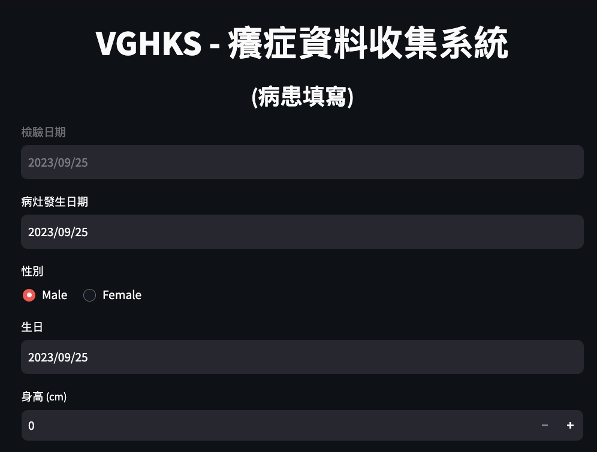
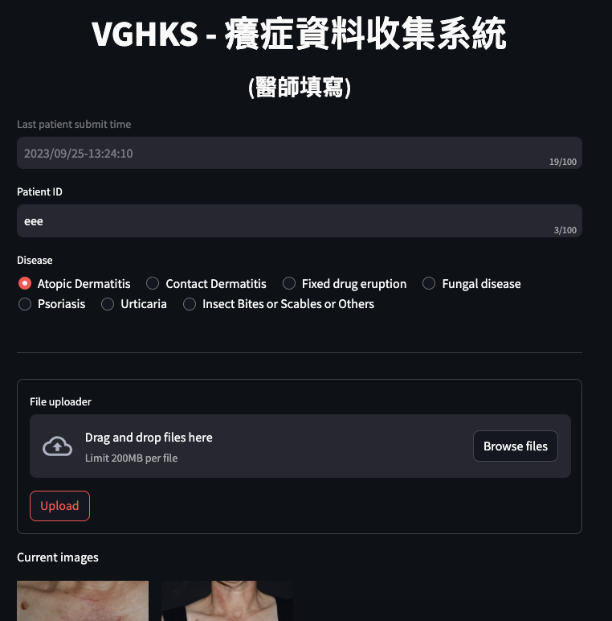
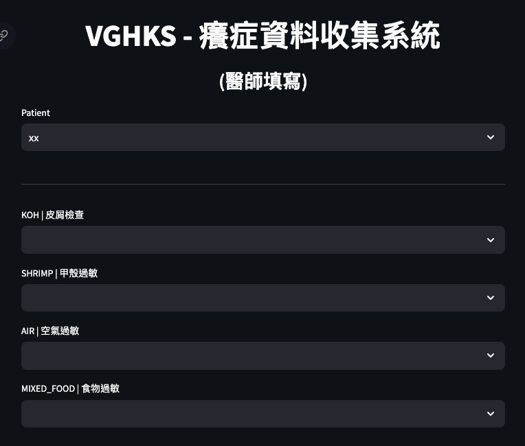
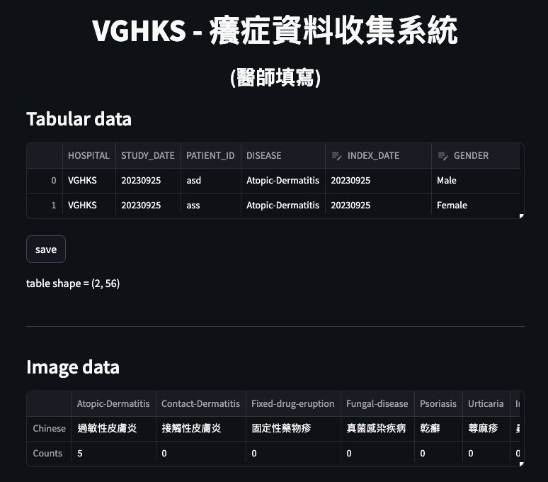

### Installation
+ Git (a version control tool for installation and auto-updating)
    + Linux or MacOS: has been installed in default
    + Windows: download [here](https://git-scm.com/download/win)
+ Download this repo
    + Open terminal in Desktop
    ```bash
    git clone https://github.com/bnbsking/itch-collection-web.git
    ```
+ Python 3+: [Miniconda3](https://docs.conda.io/projects/miniconda/en/latest/)
+ Python packages:
    + Open terminal in the cloned folder
        ```bash
        pip install -r requirements.txt
        ```


### Quick start
+ Linux / MacOS
    ```bash
    ./start.sh
    ```
+ Windows
    ```bash
    start.bat
    ```
It will show the IP address of the web server. To connect to the server by another device, type the "IP:8501" on the web address bar then enter it.


### File structure
+ .streamlit/config.toml | global config of the web UI
+ data/ | auto-generated after login
    + VGHKS/ or EDA/ or KCGMH/ or  KMU/ | hospital name
        + .tmp/ | Uploaded images. Can be previewed and deleted by web
            + patient_data.json | Generated after P1. Note that submit at P1 again will **replace** this file. Be deleted after P2
            + \<hospital_name\>\_\<date\>\_\<patient_id\>\_\<disease\>.json | Generated after P2. Note that submit at P2 again will **keep** this file. Be deleted after P3
            + *.jpg | Generated in P2 and be moved to export_img/ (if checked) or be deleted (if not checked) after submitting
        + export_img/ | Exported images. Cannot be previewed or deleted by web
            + Atopic-Dermatitis/*.jpg
            + Contact-Dermatitis/*.jpg
            + Fixed-drug-eruption/*.jpg
            + Fungal-disease/*.jpg
            + Insect-Bites-or-Scables-or-Others/*.jpg
            + Psoriasis/*.jpg
            + Urticaria/*.jpg
        + export_tab/
            + data.csv | Exported Tabular data. Can be edited in P4
+ pages/
    + P0-Login.py | Select hospital and login / logout
    + P1-Patient-Filling.py
    + P2-Doctor-Filling-A.py | Collect images 
    + P3-Doctor-Filling-B.py | Collect reset columns
    + P4-Table.py | Editable tabular data for all patients and Non-editable images stats
    + cdm.csv | common data model of each columns
+ show/*.png | pages
+ config.yaml | configuration include login information
+ main.py | auto nevigate to P0-Login.py
+ requirements.txt | python packages need to be installed
+ session.json | store login permission and data of clients for the web server
+ start.sh or start.bat | start the web server
+ update.sh or update.bat | restore default & update the latest version
+ utils.py | some functions
+ version_* | denote the current version


### Deploy notes
+ Account and Password can be changed in Config.yaml
+ Disconnect WIFI to others, then open hotspot for the phone
+ Must turn off the firewall
+ Must turn off the auto-sleep


### Reset default or Update the latest released version (Should connect to internet)
+ Linux / MacOS
    ```bash
    ./update.sh
    ```
+ Windows
    ```bash
    update.bat
    ```


### Pages
Login Page

First Page

Second Page

Third Page

Fourth Page

